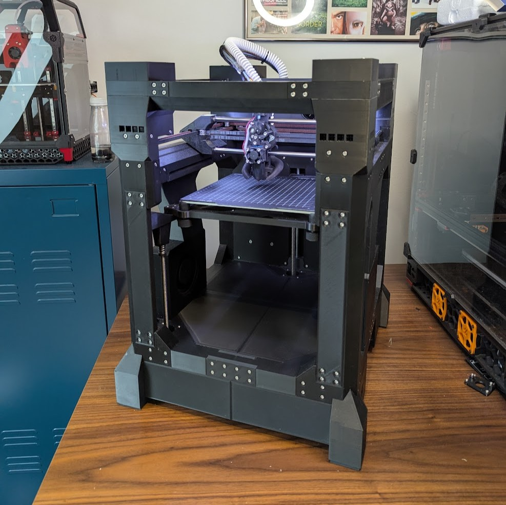

# T250 Documentation

## 1. Project

This is the official documentation for the T250 3D printer.
It is designed as an open-source platform for extreme acceleration and print speeds, pushing the limits of what FDM printers can achieve.

Special thanks to the T250 community and all contributors who have tested, improved, and shared their ideas. This printer wouldn’t exist without your effort and dedication.

Printer Github：https://github.com/MSzturc/T250
Firmware Github: https://github.com/MSzturc/THEOS
Configuration Github: https://github.com/MSzturc/THE100-Configuration

## 2. BOM & Changes

Please check the BOM [here](../BOM/README.md).

## 3. Printed parts:

TODO:
This chapter is designed to make printing the T250 parts as easy as possible — especially for first-time builders.

Here you’ll find:
- A complete list of all parts you need to print 
- The recommended print orientation for best strength and fit
- Recommended print settings that work reliably
- Advice on when and how to use supports
- Extra tips to avoid common mistakes during printing

By following these instructions, even first-time builders can get high-quality, dimensionally accurate parts without trial and error.
As a reference here is the Print Guide for the T100: https://theforgetful.dev/the100/1.1/printing-guide/top-frame/

## 4. Wiring

### BTT Kraken

***Note: Check your fan voltage before you set the fan jumpers, the jumpers for fan in below diagram are all set to 24v. Also check that the DIAG Pins for X and Y are set.***

## 5. Firmware&OS

You can find the Firmware for the T250 [here](https://github.com/MSzturc/THEOS) 