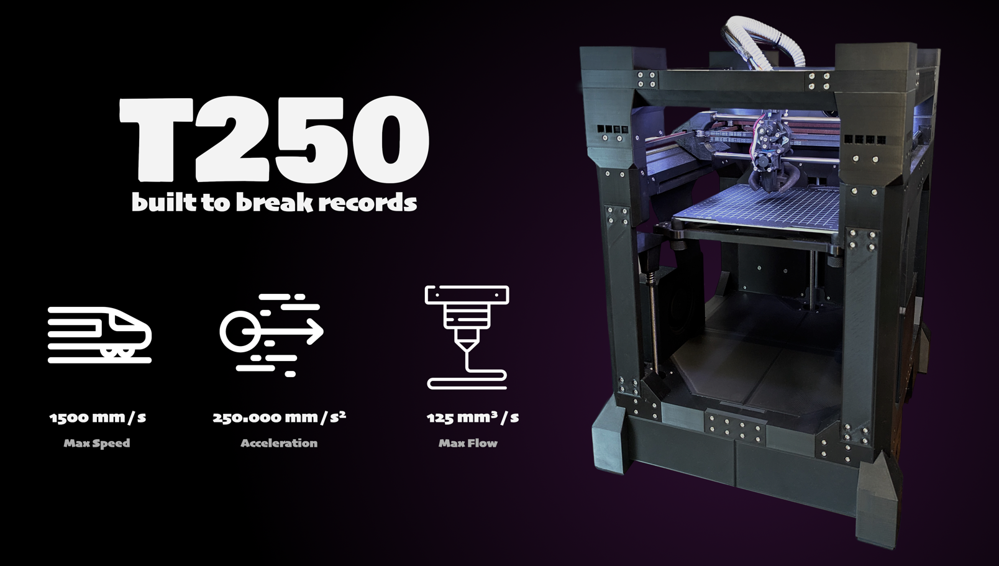
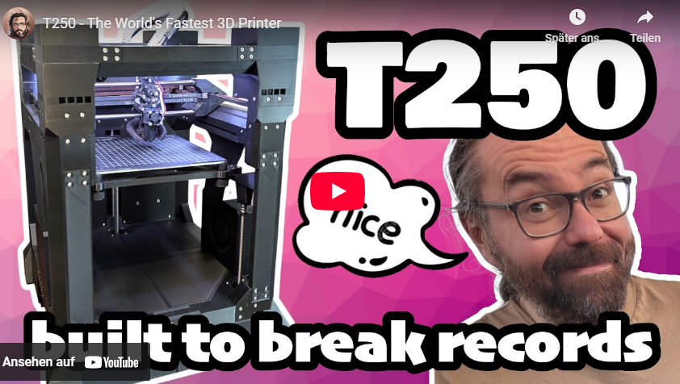

# T250 – World's Fastest Open-Source 3D Printer

The **T250** is a next-generation, high-performance 3D printer built from the ground up for speed, reliability, and print quality.  
With verified real-world acceleration of up to **250,000 mm/s²** and sustained print speeds exceeding **1,000 mm/s**, the T250 sets a new benchmark in open-source high-speed 3D printing.

> ⚠️ This is not your average printer project. The T250 is designed for experienced builders and performance enthusiasts.

---

- Prints a **Speedboat in under 2 minutes**  
- Produces **high-quality parts 4× faster** compared to a Bambu Printer
- Currently ranks **#1 on the world’s fastest printer leaderboard**
- And the best part: It’s **100% open-source**.  
  All resources needed to build your own T250 are available in this repository.

---

## 🚀 Key Features

- 💨 **Acceleration**: Up to **250,000 mm/s²** – proven in real prints, not just on paper
- ⚡ **Speed**: Infill at **1500 mm/s**, outer walls at **600+ mm/s**
- 🔄 **Motion**: Quad-motor CoreXY Kinematics, driven by TMC2160 stepper drivers at up to **60 V**
- 🧠 **Toolhead**: Custom direct drive, **center-of-gravity optimized** for rod-based gantry
- 🔥 **Hotend**: Compatible with all major high-flow systems (Rapido, Mosquito Magnum+, Goliath, etc.)
- 🌪️ **Cooling**: Remote CPAP cooling + dual side blowers + active motor cooling
- 🛏️ **Leveling**: Automatic **Z-tilt bed leveling** with real-time distance measuring sensor
- 📦 **Build Volume**: **192 × 212 × 175 mm**
- 🌈 **Design**: Cable routing inside the frame, RGB lighting along the top frame, enclosure-ready layout
- 🧑‍💻 **Firmware**: Based on THEOS / Klipper, optimized for high-speed printing
- 🧾 **Open Source**: All files, configs, BOMs and documentation provided

---

## Links
- [Bill of Material](https://docs.google.com/spreadsheets/d/1wDRmPbQatBhcjkK7rbawSzn-e6-QCa2Ty5k3KTWX-eA)
- [Join our Discord Server](https://discord.gg/fW7BcUErgZ)
- [Support this Project on Patreon](https://www.patreon.com/The100)
- [Grad the CAD files](/CAD)
- [Our Community on Facebook](https://www.facebook.com/groups/181335024786568)
- [Printers build by the Community](https://discord.com/channels/1086229147107459133/1288142417824055469)

---

## 📎 License

This project is licensed under the **Creative Commons** (Attribution-NonCommercial-ShareAlike 4.0 International).

You are free to build, remix, and adapt the printers design as long as you give credit, indicate changes, and use it only for non-commercial purposes. Any derivatives must be shared under the same license, and you may not impose additional legal or technical restrictions.

---

## ❤️ Credits

- Developed and tested by [@MattThePrintingNerd](https://www.youtube.com/@MattThePrintingNerd)  
- Special thanks to [@Volgger](https://www.youtube.com/@Volgger2278), who supported the entire Alpha phase with testing, feedback, and countless improvements that helped shape the final printer.
- Endless gratitude to all my **Patreon supporters**, whose ongoing support makes projects like this possible!

---

**Ready to build the world's fastest open-source printer? Let's go.**
